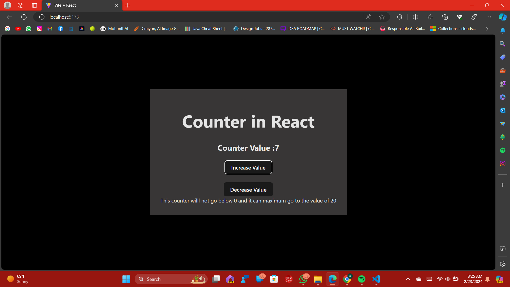

# React Counter Application

This is a simple counter application built using React. It allows you to increase or decrease a counter value within a specified range.

## Getting Started

To get started with the project, follow these steps:

1. Clone the repository: `git clone [repository URL]`
2. Install the dependencies: `npm install`
3. Run the application: `npm start`
4. Open your browser and navigate to `http://localhost:3000` to view the application.

## Usage

Once the application is running, you will see a counter value displayed on the screen. You can use the buttons provided to increase or decrease the counter value. The counter will not go below 0 and can maximum go up to 20.

## Technologies Used

- React
- JavaScript
- HTML
- CSS

## Contributing

Contributions are welcome! If you find any issues or want to add new features, feel free to open a pull request.

## License

This project is licensed under the [MIT License](LICENSE).

## Acknowledgements

- [React](https://reactjs.org) - JavaScript library for building user interfaces.
- [Create React App](https://create-react-app.dev) - Tool for creating React applications with zero configuration.

Feel free to customize this README file according to your project's specific details.
